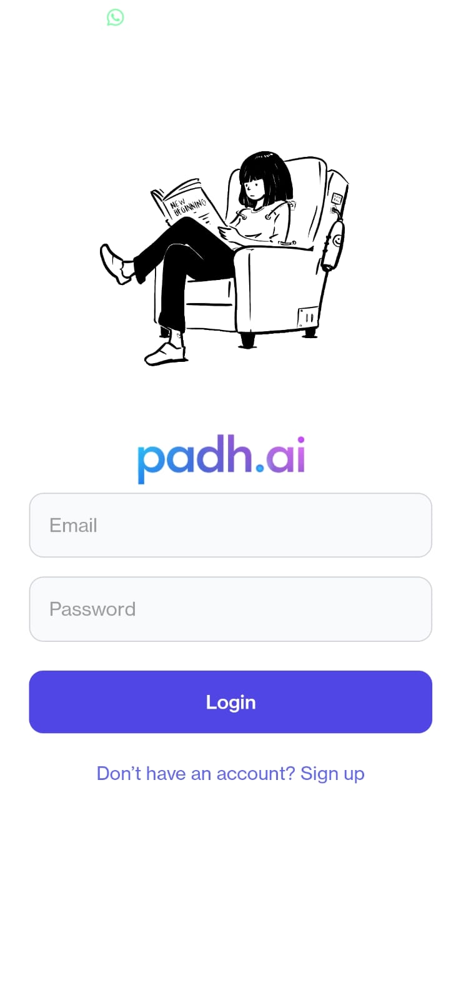
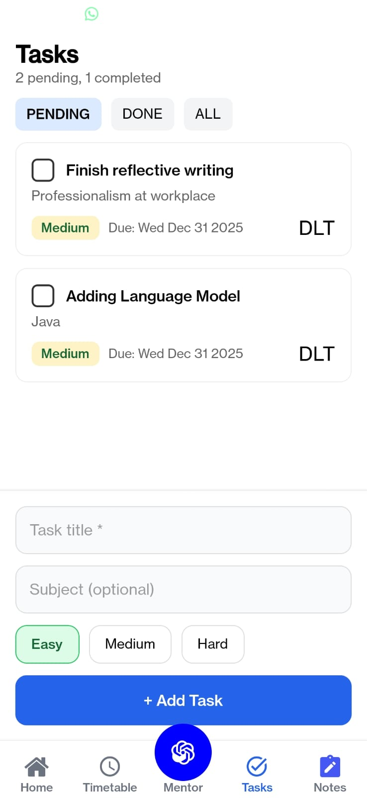
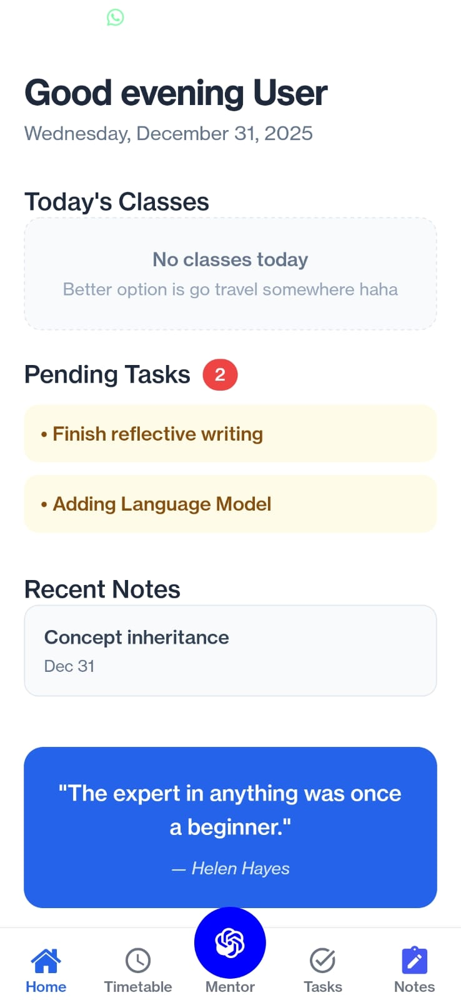

# padh.ai


**padh.ai** is a student-focused mobile application designed to help learners organize their academic life effectively. The name is inspired by the nepali word *"padh"*, meaning to study and the *".ai"* means AI integrated.

This is my first React Native project, built with **Expo** for rapid development and cross-platform compatibility.

## Overview

padh.ai provides essential tools for students in one clean, intuitive interface:
- Track daily timetable
- Manage tasks and assignments
- Take and organize notes
- Access an AI-powered study mentor

The app emphasizes simplicity, offline-first functionality, and a pleasant user experience.

## Current Features

- Login & Signup screens
- Bottom tab navigation
- Home dashboard with overview
- Timetable management
- Tasks (to-do list)
- Notes section
- AI Mentor chat interface (local placeholder)

## Planned Features (Version 2)

- Firebase Authentication (Email + Google Sign-In)
- Cloud sync with Firestore
- AI Mentor powered by real LLM integration
- Study reminders & notifications
- Dark mode support
- Progress analytics

## Tech Stack

- **React Native** with **Expo** (Managed workflow)
- **Expo Router** for file-based routing and navigation
- **AsyncStorage** for local data persistence
- **React Native** core components (no external UI library yet)
- **TypeScript** for type safety

Firebase integration planned for future versions.

## Project Structure
```text
app/
│
├── (auth)/        # Login & Signup screens
├── (tabs)/        # Bottom tab navigation
│   ├── Home
│   ├── Timetable
│   ├── Tasks
│   ├── Notes
│   └── AI Mentor
│
├── components/    # Reusable UI components
├── utils/         # Helpers (AsyncStorage)
├── assets/        # Images & icons

```

## Data Storage

Currently, all user data (tasks, notes, timetable, AI chat history) is stored locally using **AsyncStorage**. This ensures full offline functionality and fast performance.

**Future Plan**: Migrate to **Firebase Authentication** and **Firestore** in Version 2 for secure cloud sync across devices.

## Screenshots

<div align="center">







</div>


## Getting Started using this app 

### Prerequisites

- Node.js (v18 or later)
- Expo CLI: `npm install -g expo-cli`
- Expo Go app on your phone (iOS/Android)

### Installation & Run

```bash
# Clone the repository
git clone https://github.com/Pr4ba5/padh.ai
cd padh.ai

# Install dependencies
npm install
# or
yarn install

# Start the development server
npx expo start

## Get started

1. Install dependencies

   ```bash
   npm install
   ```

2. Start the app

   ```bash
   npx expo start
   ```

In the output, you'll find options to open the app in a

- [development build](https://docs.expo.dev/develop/development-builds/introduction/)
- [Android emulator](https://docs.expo.dev/workflow/android-studio-emulator/)
- [iOS simulator](https://docs.expo.dev/workflow/ios-simulator/)
- [Expo Go](https://expo.dev/go), a limited sandbox for trying out app development with Expo

You can start developing by editing the files inside the **app** directory. This project uses [file-based routing](https://docs.expo.dev/router/introduction).

## Get a fresh project

When you're ready, run:

```bash
npm run reset-project
```

This command will move the starter code to the **app-example** directory and create a blank **app** directory where you can start developing.

## Learn more

To learn more about developing your project with Expo, look at the following resources:

- [Expo documentation](https://docs.expo.dev/): Learn fundamentals, or go into advanced topics with our [guides](https://docs.expo.dev/guides).
- [Learn Expo tutorial](https://docs.expo.dev/tutorial/introduction/): Follow a step-by-step tutorial where you'll create a project that runs on Android, iOS, and the web.

## Join the community

Join our community of developers creating universal apps.

- [Expo on GitHub](https://github.com/expo/expo): View our open source platform and contribute.
- [Discord community](https://chat.expo.dev): Chat with Expo users and ask questions.
